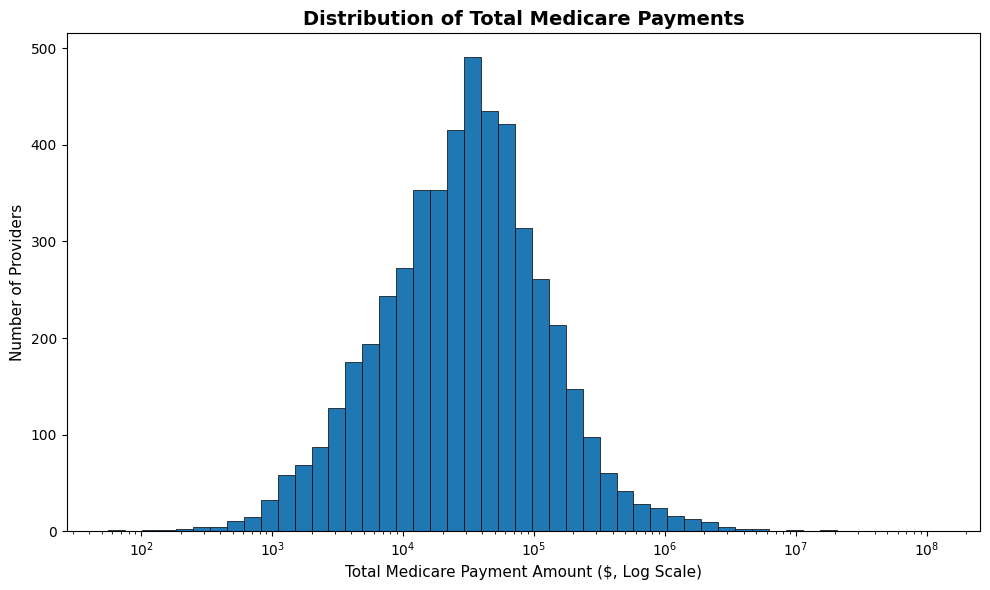
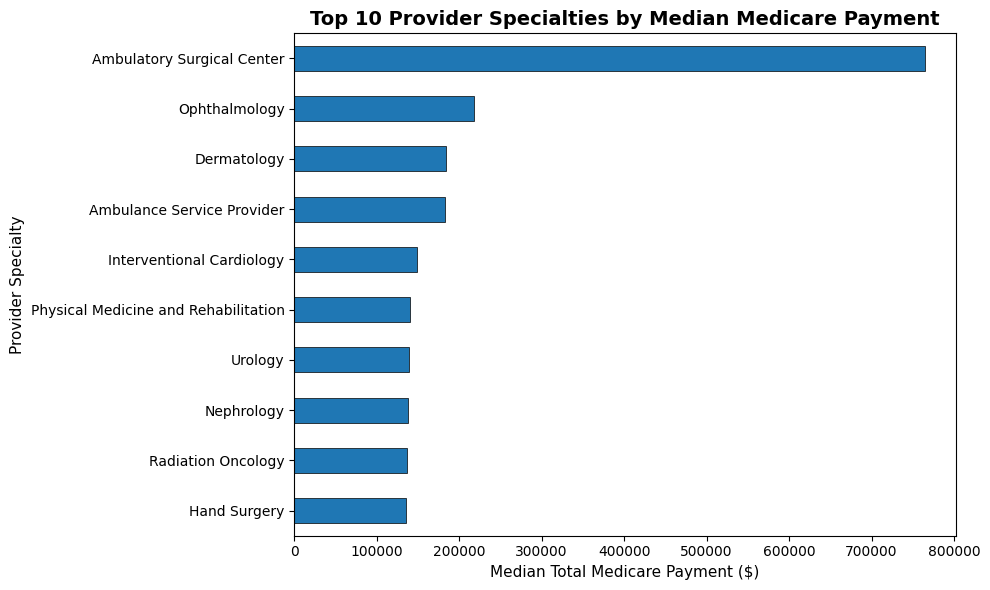
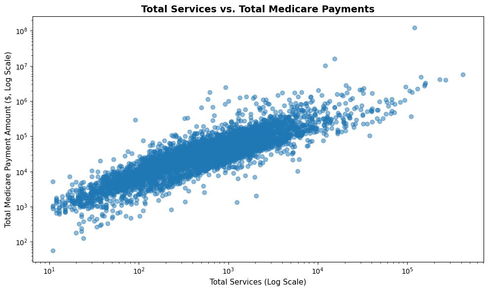
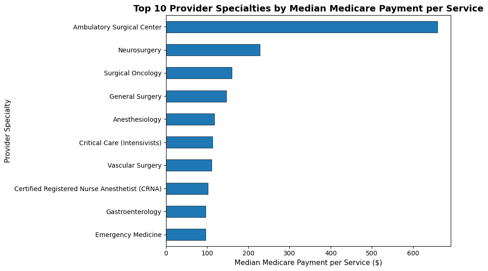

# Medicare Provider Payment Analysis
## Project Overview

Why do some Medicare providers receive substantially more in Medicare payments than others?

This project analyzes a sample of 5,000 Medicare providers to examine whether differences in Medicare payments are associated with provider volume, specialty, and payment intensity.

This analysis was completed in Python using publicly available Medicare data from the Centers for Medicare and Medicaid Services (CMS).

## Research Questions

This project focuses on four questions:

1. What factors are associated with higher Medicare payments?
2. How strongly is provider volume associated with total Medicare payments?
3. Do Medicare payment levels differ across provider specialties?
4. Are higher payments explained only by volume, or do payment-per-service differences also matter?

## Tools Used 

-Python
-pandas
-NumPy
-Matplotlib
-Jupyter Notebook
-VS Code

## Dataset

The analysis uses the CMS Medicare Physician & Other Practitioners - by Provider dataset.

The analytical sample contains:

-5000 Medicare providers
-87 provider specialties 
-Beneficiary counts
-Total services
-Total Medicare payment amounts
-Provider specialty information

The raw CMS dataset is not included in this repository. Dee the `data/README.md` file for source information.

## Data Preparation

The dataset was cleaned before analysis by:
-Converting numeric variables to appropriate data types
-Checking missing values
-Creating payment-per-beneficiary and payment-per-service variables
-Reviewing extreme values rather than automatically removing them
-Restricting certain specialty comparisons to groups containing at least 10 providers

Because Medicare payment and service variables were highly right skewed, median statistics, logarithmic visualizations, and Spearman rank correlations were used where appropriate. 

## Key Findings

### 1. Medicare payments were highly right skewed

The average Medicare payment in the sample was approximately **$111,655.73**, while the median was only **$30,645.92**.

The 99th percentile was approximately **$997,573.34**.

This large difference between the mean and median demonstrated the influence of extreme upper-tail payment values. 

### 2. Service volume had the strongest association with Medicare payments

The Spearman correlation between total services and total Medicare payments was:
**0.887**

This represents a very strong positive association. 

Beneficiary volume was also strongly associated with Medicare payments:

**Spearman correlation = 0.813**

Beneficiary volume and service volume were themselves strongly related:

**Spearman correlation = 0.751**

### 3. Provider specialty was associated with payment differences

Among specialties represented by at least 10 providers, Ambulatory Surgical centers had the highest median total Medicare payment:

**$764,227.66**

Selected procedure-heavy specialties also had a higher median Medicare payment than selected primary-care specialties:

-Primary care median: **$35,325.46**
-Procedure-heavy median: **$74,582.77**

### 4. Volume did not explain all payment differences.

Median Medicare payment per service also varied substantially across specialties.

Ambulatory Surgical Centers had the highest median Medicare payment per service:

**$658.70 per service**

Neurosurgery ranked second at approximately:

**227.68 per service**

These findings suggest that higher total Medicare payments are associated with both provider volume and differences in payment intensity.

### 5. Extreme payment providers had a distinct profile

Providers above the 99th percentile had substantially higher beneficiary counts, service volume, and payment intensity than the overall sample.

The median provider in the full sample had:

-153 beneficiaries
-451 services
-Approximately $30,646 in Medicare payments

The upper 1% had median values of approximately:

-741 beneficiaries
-19,846 services
-$1.73 million in Medicare payments

## Visualizations

### Medicare Payment Distribution

### Top Specialties by Median Medicare Payment

### Services vs. Medicare Payments

### Median Medicare Payment per Service

## Analytical Lessons

This project reinforced several important data analysis concepts:

-Mean versus median for skewed distributions
-Identifying and investigating outliers
-Using logarithmic scales for highly skewed data
-Pearson versus Spearman correlation
-Interpreting association without claiming causation
-Filtering small comparison groups
-Using grouped summary statistics with pandas
-Evaluating both volume and payment intensity

## Limitations

This analysis is descriptive and identifies associations within the sample. 

It does not establish causal relationships or determine whether individual Medicare payments were appropriate or inappropriate.

Additional variables such as procedure type, patient complexity, geographic variation, case mix, and reimbursement policy could help explain differences between specialties. 

## Article

A full discussion of the project and findings is available in my Medium article:
**Why Do Some Medicare Providers Receive More? Volume Explains a Lot, But Not Everything**

https://medium.com/@reed.janessa21/why-do-some-medicare-providers-receive-more-volume-explains-a-lot-but-not-everything-f134012d2d88

## Author
**Janessa Reed**

Healthcare Data Analytics | Python | Data Visualization | Public Healthcare Data
